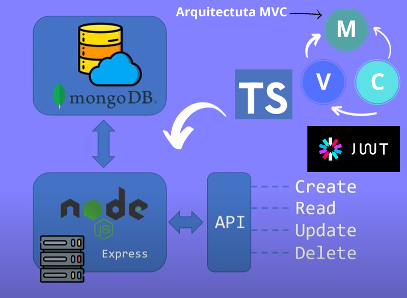

# NODE.JS API REST / CRUD DE PRODUCTOS

Tecnologias utilizadas:
 
Lenguaje: Typescript
 
Base de datos: Mongoose/MONGODB Atlas + Mongoose.
 
Back-End: NodeJs, ExpressJs,
 
 
Seguridad/Autentificacion: JWT Tokens.
 
 
Peticiones http/: insonmia ,
 

## Imagenes

BY____________MATHIAS_MLC____________________